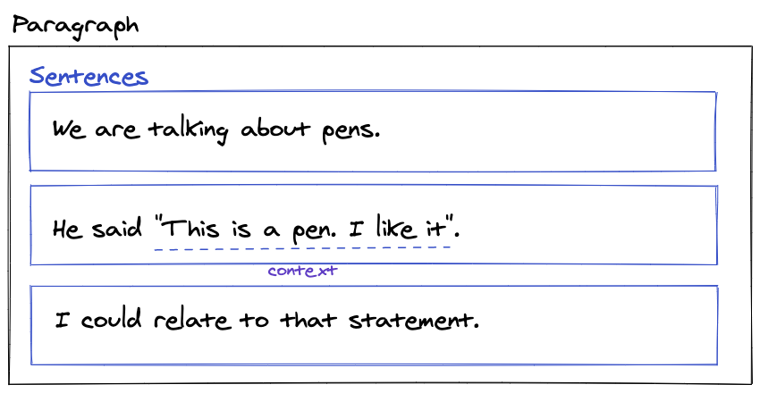

# sentence-splitter

Split {Japanese, English} text into sentences.

## What is sentence?

This library split next text into 3 sentences.

```
We are talking about pens.
He said "This is a pen. I like it".
I could relate to that statement.
```

Result is:



You can check actual AST in online playground.

- <https://sentence-splitter.netlify.app/#We%20are%20talking%20about%20pens.%0AHe%20said%20%22This%20is%20a%20pen.%20I%20like%20it%22.%0AI%20could%20relate%20to%20that%20statement.>

Second sentence includes `"This is a pen. I like it"`, but this library can not split it into new sentence.
The reason is `"..."` and `「...」` text is ambiguous as a sentence or a proper noun.
Also, HTML does not have suitable semantics for conversation.

- [html - Most semantic way to markup a conversation (or interview)? - Stack Overflow](https://stackoverflow.com/questions/8798685/most-semantic-way-to-markup-a-conversation-or-interview)

As a result, The second line will be one sentence, but sentence-splitter add a `contexts` info to the sentence node.

```json5
{
    "type": "Sentence",
    "children": [
      {
        "type": "Str",
        "value": "He said \"This is a pen. I like it\""
      },
      ...
    ],
    "contexts": [
        {
            "type": "PairMark",
            "pairMark": {
                "key": "double quote",
                "start": "\"",
                "end": "\""
            },
            "range": [
                8,
                33
            ],
            ...
        ]
    ]
}
```

- Example: <https://sentence-splitter.netlify.app/#He%20said%20%22This%20is%20a%20pen.%20I%20like%20it%22.>

Probably, textlint rule should handle the `"..."` and `「...」` text after parsing sentences by sentence-splitter.

- Issue: [Nesting Sentences Support · Issue #27 · textlint-rule/sentence-splitter](https://github.com/textlint-rule/sentence-splitter/issues/27)
- Related PR
  - https://github.com/textlint-ja/textlint-rule-no-doubled-joshi/pull/47
  - https://github.com/textlint-ja/textlint-rule-no-doubled-conjunctive-particle-ga/pull/27
  - https://github.com/textlint-ja/textlint-rule-max-ten/pull/24

## Installation

    npm install sentence-splitter

## Usage

```ts
export interface SeparatorParserOptions {
    /**
     * Recognize each characters as separator
     * Example [".", "!", "?"]
     */
    separatorCharacters?: string[]
}

export interface AbbrMarkerOptions {
    language?: Language;
}

export interface splitOptions {
    /**
     * Separator & AbbrMarker options
     */
    SeparatorParser?: SeparatorParserOptions;
    AbbrMarker?: AbbrMarkerOptions;
}

/**
 * split `text` into Sentence nodes.
 * This function return array of Sentence nodes.
 */
export declare function split(text: string, options?: splitOptions): TxtParentNodeWithSentenceNode["children"];

/**
 * Convert Paragraph Node to Paragraph Node that includes Sentence Node.
 * Paragraph Node is defined in textlint's TxtAST.
 * See https://github.com/textlint/textlint/blob/master/docs/txtnode.md
 */
export declare function splitAST(paragraphNode: TxtParentNode, options?: splitOptions): TxtParentNodeWithSentenceNode;
```

See also [TxtAST](https://github.com/textlint/textlint/blob/master/docs/txtnode.md "TxtAST").

### Example

- Online playground: <https://sentence-splitter.netlify.app/>

## Node

This node is based on [TxtAST](https://github.com/textlint/textlint/blob/master/docs/txtnode.md "TxtAST").

### Node's type

- `Str`: Str node has `value`. It is same as TxtAST's `Str` node.
- `Sentence`: Sentence Node has `Str`, `WhiteSpace`, or `Punctuation` nodes as children
- `WhiteSpace`: WhiteSpace Node has `\n`.
- `Punctuation`: Punctuation Node has `.`, `。`

Get these `SentenceSplitterSyntax` constants value from the module:

```js
import { SentenceSplitterSyntax } from "sentence-splitter";

console.log(SentenceSplitterSyntax.Sentence);// "Sentence"
```

### Node's interface

```ts
export type SentencePairMarkContext = {
  type: "PairMark";
  range: readonly [startIndex: number, endIndex: number];
  loc: {
    start: {
      line: number;
      column: number;
    };
    end: {
      line: number;
      column: number;
    };
  };
};
export type TxtSentenceNode = Omit<TxtParentNode, "type"> & {
    readonly type: "Sentence";
    readonly contexts?: TxtPairMarkNode[];
};
export type TxtWhiteSpaceNode = Omit<TxtTextNode, "type"> & {
    readonly type: "WhiteSpace";
};
export type TxtPunctuationNode = Omit<TxtTextNode, "type"> & {
    readonly type: "Punctuation";
};
```

Fore more details, Please see [TxtAST](https://github.com/textlint/textlint/blob/master/docs/txtnode.md "TxtAST").

### Node layout

Node layout image.

- Example: <https://sentence-splitter.netlify.app/#This%20is%201st%20sentence.%20This%20is%202nd%20sentence.>

> This is 1st sentence. This is 2nd sentence.

```
<Sentence>
    <Str />                      |This is 1st sentence|
    <Punctuation />              |.|
</Sentence>
<WhiteSpace />                   | |
<Sentence>
    <Str />                      |This is 2nd sentence|
    <Punctuation />              |.|
</Sentence>
```

Note: This library will not split `Str` into `Str` and `WhiteSpace`(tokenize)
Because, Tokenize need to implement language specific context.

### For textlint rule

You can use `splitAST` for textlint rule.
`splitAST` function can preserve original AST's position unlike `split` function.

```ts
import { splitAST, SentenceSplitterSyntax } from "sentence-splitter";

export default function(context, options = {}) {
    const { Syntax, RuleError, report, getSource } = context;
    return {
        [Syntax.Paragraph](node) {
            const parsedNode = splitAST(node);
            const sentenceNodes = parsedNode.children.filter(childNode => childNode.type === SentenceSplitterSyntax.Sentence);
            console.log(sentenceNodes); // => Sentence nodes
        }
    }
}
```

Examples

- [textlint-ja/textlint-rule-max-ten: textlint rule that limit maxinum ten(、) count of sentence.](https://github.com/textlint-ja/textlint-rule-max-ten)

## Reference

This library use ["Golden Rule" test](test/pragmatic_segmenter/test.ts) of `pragmatic_segmenter` for testing.

- [diasks2/pragmatic_segmenter: Pragmatic Segmenter is a rule-based sentence boundary detection gem that works out-of-the-box across many languages.](https://github.com/diasks2/pragmatic_segmenter "diasks2/pragmatic_segmenter: Pragmatic Segmenter is a rule-based sentence boundary detection gem that works out-of-the-box across many languages.")

## Related Libraries

- [textlint-util-to-string](https://github.com/textlint/textlint-util-to-string)
- and <https://github.com/textlint/textlint/wiki/Collection-of-textlint-rule#rule-libraries>

## Tests

Run tests:

    npm test

Create `input.json` from `_input.md`

    npm run createInputJson

Update snapshots(`output.json`):

    npm run updateSnapshot

### Adding snapshot testcase

1. Create `test/fixtures/<test-case-name>/` directory
2. Put `test/fixtures/<test-case-name>/_input.md` with testing content
3. Run `npm run updateSnapshot`
4. Check the `test/fixtures/<test-case-name>/output.json`
5. If it is ok, commit it

## Contributing

1. Fork it!
2. Create your feature branch: `git checkout -b my-new-feature`
3. Commit your changes: `git commit -am 'Add some feature'`
4. Push to the branch: `git push origin my-new-feature`
5. Submit a pull request :D

## License

MIT
